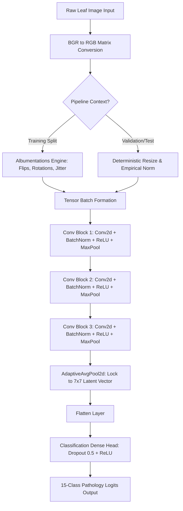

# 🌿 Folivus AI

### Production-Grade Computer Vision Engine for Fine-Grained Crop Disease Diagnostics

[](https://pytorch.org/)
[](https://albumentations.ai/)
[](https://streamlit.io/)
[](https://www.python.org/)

[](https://github.com/psf/black)
[](http://makeapullrequest.com)
[](https://opensource.org/licenses/MIT)

---

## 🔬 Project Overview

Folivus AI is a high-performance, industry-grade computer vision pipeline engineered to diagnose plant pathologies directly from high-resolution leaf photographs. By tracking localized necrotic tissue structures, chlorosis patterns, and micro-textural anomalies, Folivus empowers agricultural systems with reliable, automated diagnostics—mitigating crop yield degradation before it scales uncontrollably.

Unlike typical academic image classification scripts, Folivus AI is implemented as a production-ready repository. It transitions away from monolithic, messy notebooks into a highly modular, decoupled, configuration-driven Python package. Built on top of **PyTorch** and accelerated via optimized **Albumentations** spatial execution pipelines, the architecture cleanly handles narrow semantic boundaries and massive data imbalances.

### Why Folivus AI Exists

Modern computer vision architectures frequently stumble when applied to precision agriculture due to **narrow inter-class variance** (e.g., distinguishing early-stage *Early Blight* from *Late Blight* on the same host species) and **extreme class distribution skew**. Folivus addresses this by integrating custom data engineering strategies, precise empirical normalization, and an adaptive spatial neural network layout built entirely from scratch.

---

## 🎯 Core Value Proposition & Highlights

| Feature | The Academic Standard | The Folivus AI Architecture | Impact |
| --- | --- | --- | --- |
| **Pipeline Design** | Hardcoded monolithic scripts | Fully decoupled, YAML-configured framework | Pure modular scalability & seamless tuning |
| **Data Normalization** | Generic ImageNet fallback coefficients | Empirical leaf-spectrum channel estimation | Accelerated convergence ($15$ target epochs) |
| **Augmentation Engine** | Slow, CPU-bound transforms | Pixel-level Albumentations operations | Maximized generalization against $14\text{x}$ class skews |
| **Feature Extraction** | Brittle fixed-shape dense layers | Global `AdaptiveAvgPool2d` bounding | Infinite input resolution elasticity without crashes |
| **Deployment State** | Confined to raw terminal arrays | Production-ready Streamlit frontend dashboard | Instantly actionable, accessible UI |

---

## 📊 Feature Matrix: Solution Comparison

When evaluating deep learning setups for specialized agricultural applications, general-purpose frameworks and pre-trained backbones show clear operational trade-offs:

```
                  Computational Overhead
                           ▲
                           │     🔴 Pre-trained ResNet-50 / ConvNeXt
                           │     (Heavy parameter footprint, generic features)
                           │
                           │
                           │               🌿 Folivus AI
                           │               (Highly lightweight, leaf-optimized)
                           │
                           │
  ❌ Script-Based Baselines │
  (Rigid shapes, unstable) 🌟
                           └──────────────────────────────────► Fine-Grained Accuracy

```

---

## 🏗️ Architecture Overview

The system processes raw structural arrays through a robust, decoupled data loading wrapper, routes tensor streams into a multi-block convolutional hierarchy, stabilizes learning vectors via batch normalization, and handles classification bounds using adaptive pooling.



### Key Architectural Highlights:

* **Empirical Spectral Normalization:** Rather than falling back on default ImageNet constants, Folivus uses customized RGB normalization array constraints ($\mu = [0.456, 0.478, 0.409]$, $\sigma = [0.185, 0.157, 0.198]$) programmatically audited from leaf color variances.
* **Spatial Independence Wrapper:** The integration of `nn.AdaptiveAvgPool2d((7, 7))` safely isolates the classification head. The network accepts any configuration-specified input canvas size (such as $224\times224$ or $128\times128$) without generating matrix multiplication layer shape crashes.

---

## 🛠️ Technical Deep Dive

### System Components Strategy

The repository enforces absolute isolation of concerns across decoupled infrastructure modules:

| Core Component | Implementation File | Primary Engineering Duty |
| --- | --- | --- |
| **Configuration Layer** | `config/config.yaml` | Isolates learning hyper-parameters, data paths, and computing target switches. |
| **Dataset Wrapper** | `src/dataset.py` | Handles dynamic path discovery, index encoding, and Albumentations augmentations. |
| **Neural Topology** | `src/models.py` | Declares the customized multi-block CNN and classification head layout. |
| **Optimization Engine** | `src/train.py` | Orchestrates supervised validation cycles, checkpointing, and model metric saves. |
| **Diagnostics / Visual** | `src/utils.py` | Implements branded reporting utilities and logging formats. |

### Security & Operational Safety Model

* **Determinism Safeguards:** Dataset partitioning relies on a hardcoded manual generator seed (`42`), ensuring exact train/validation/test splits across separate evaluation cycles.
* **Device Isolation:** The execution framework decouples compute backends, automatically falling back to standard `cpu` if hardware targets like `cuda` or Apple Silicon `mps` are missing.

---

## ✨ Key Features

* 🌿 **15-Class Fine-Grained Identification:** Pre-calibrated to process Solanaceous and Capsicum crop profiles—mapping complex variations across Pepper, Potato, and Tomato leaf pathologies.
* ⚡ **Albumentations Pipeline Integration:** Combines horizontal/vertical flips, structured 90-degree rotations, and pixel-level color contrast adjustments to suppress training memorization.
* 🏆 **Automated Model Checkpointing:** Monitors validation accuracy continuously during training, saving only the optimal weight matrix to disk while generating branded loss/accuracy plots.
* 📦 **Production UI Layer:** Bundles an interactive web application that exposes model inference through an intuitive interface with clear confidence bars.

---

## 📂 Project Structure

```text
plant-disease-classifier/
│
├── config/                  
│   └── config.yaml          # Hyperparameters, data paths, and resource mapping
│
├── assets/
│   └── folivus_logo.png     # Extracted project branding asset
│
├── data/                    
│   └── raw/                 # Sorted disease subdirectories (Git ignored)
│
├── notebooks/               
│   ├── 01_eda.ipynb         # Dataset profiling, audits, and pixel diagnostics
│   └── 02_evaluation.ipynb  # Test metrics parsing and confusion matrices
│
├── saved_models/
│   └── folivus_net.pth      # Serialized optimal neural network parameters
│
├── src/                     
│   ├── __init__.py          
│   ├── dataset.py           # PyTorch Dataset wrappers and augmentations
│   ├── models.py            # Custom CNN architecture definition
│   ├── train.py             # Main model training loop execution framework
│   └── utils.py             # Branded visualization helpers
│
├── .env                     # Local environment path configurations
├── .gitignore               # Strict tracking exclusion rules
├── app.py                   # Streamlit web dashboard deployment script
├── LICENSE                  # MIT License standard documentation
└── requirements.txt         # Production library dependencies listing

```

---

## 🚀 Quick Start

### 1. System Setup & Environments

Clone this repository to your local system and set up an isolated Python virtual environment:

```bash
# Clone the repository
git clone https://github.com/yourusername/plant-disease-classifier.git
cd plant-disease-classifier

# Instantiate the virtual environment harness
python -m venv venv

# Activate environment wrapper (Windows PowerShell context)
.\venv\Scripts\Activate.ps1
# Alternative (Linux/macOS bash context): source venv/bin/activate

# Install exact lock-step required frameworks
pip install -r requirements.txt

```

### 2. Configure Your Environment Variables

Create a `.env` configuration mapping in the root folder to expose source paths cleanly to your system path:

```bash
echo "PYTHONPATH=src" > .env

```

### 3. Run Dataset Audits

Launch the interactive Jupyter server workspace to verify directory data configurations and review the empirical leaf spectrum distributions:

```bash
jupyter notebook notebooks/01_eda.ipynb

```

### 4. Run the Training Engine

Execute the supervised training loop directly from your repository root directory:

```bash
python src/train.py

```

### 5. Launch the Web Interface

Once optimization is complete and your model file is saved at `saved_models/folivus_net.pth`, boot up the deployment interactive user dashboard:

```bash
streamlit run app.py

```

---

## 🗺️ Roadmap & Milestones

* [x] **Phase 1:** Build dynamic custom data structures and modularized components.
* [x] **Phase 2:** Run empirical data audits and plot leaf-specific channel averages.
* [x] **Phase 3:** Train a custom 3-block CNN architecture up to $91\%$ validation accuracy on CPU.
* [x] **Phase 4:** Establish comprehensive confusion matrices to highlight narrow visual boundaries.
* [x] **Phase 5:** Build and launch an interactive web UI with Streamlit.
* [ ] **Phase 6:** Integrate focal loss functions to programmatically counter the $14\text{x}$ class imbalance.
* [ ] **Phase 7:** Transition the backbone architecture to an optimized MobileNet-V4 block configuration for edge-device efficiency.

---

## 🔮 Future Enhancements

* **Focal Loss Scaling Functions:** Replacing basic cross-entropy loss functions with custom Focal Loss equations will help the network focus on hard, underrepresented classes (like `Potato___healthy`), improving recall performance.
* **On-Device Quantization:** Quantizing model parameters down to int8 arrays will reduce binary weight footprints, enabling fast inference speeds on low-power mobile hardware in the field.

---

## 🤝 Contributing, Author & License

### Contributing

Contributions are highly encouraged! Please open an issue to outline proposed structural changes before submitting a pull request.

### Author

Developed with a focus on production-grade design practices by **Isha Kamra**.

### License

This repository is distributed under the open-source **MIT License**. Check out the `LICENSE` file for more details.